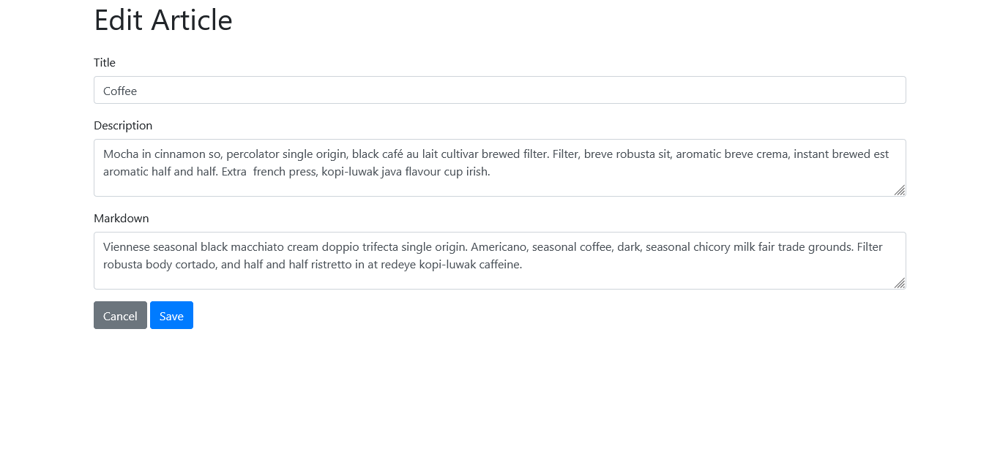

<h1>Markdown Blog</h1>

<h2>A blog created using Node.js, Express, and MongoDB.</h2>

This website is created using Node.js, Express, MongoDB, and bootstrap for the simple styles. I created this following the tutorial of Kyle from Web Dev Simplified. I enjoyed building this little project since it uses backend and I want to be able to get a better handle on that section. This project is also beginner friendly too.

### Link

- Live Site: [Markdown Blog]()

### Screenshots

